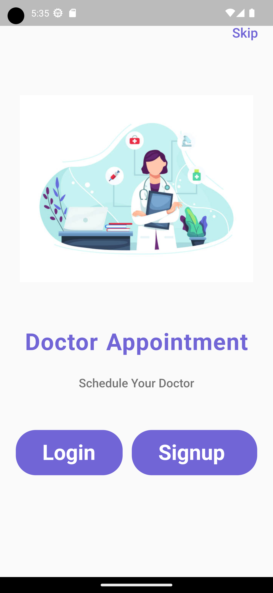
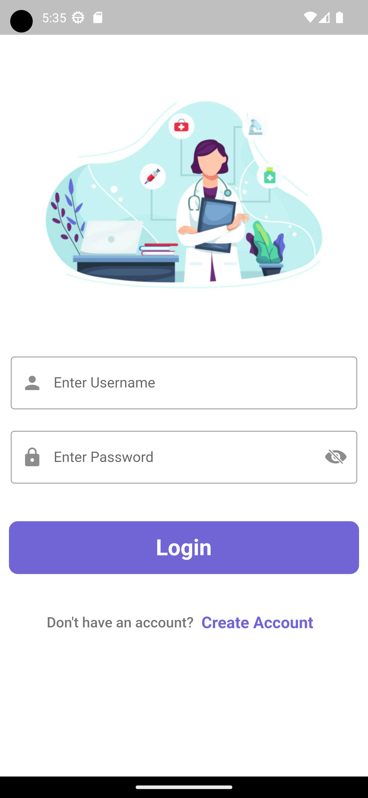
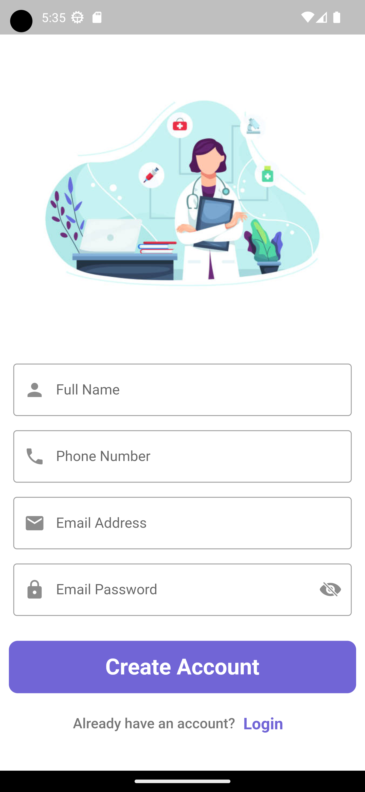
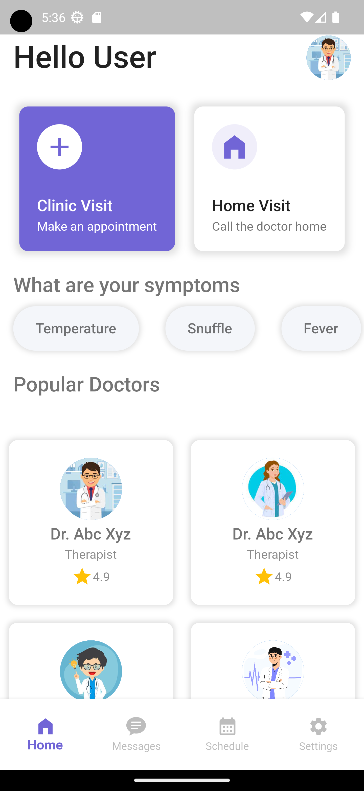
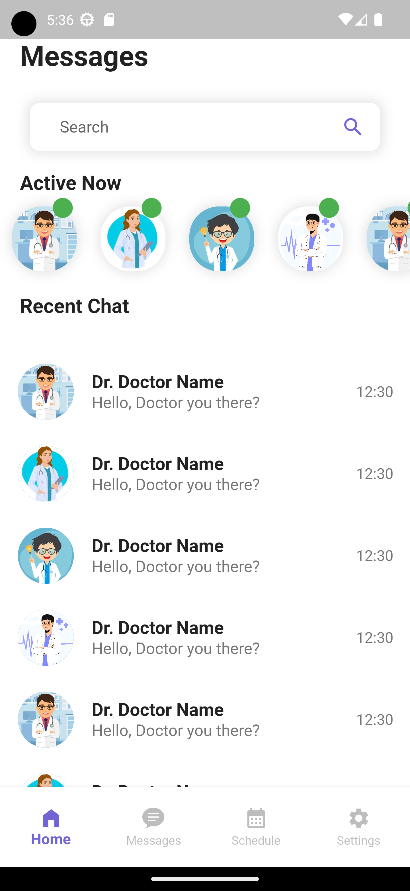
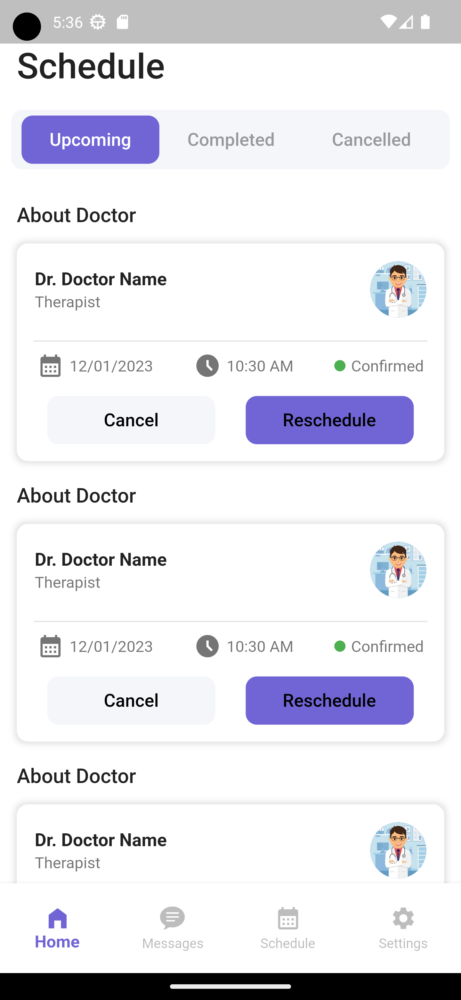
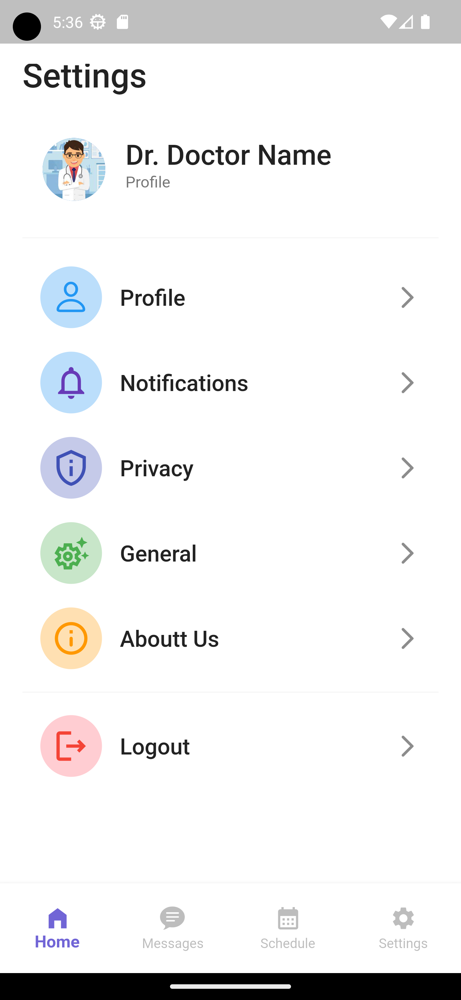

## Flutter Doctor's Appointment UI Design App

This is a beautifully designed mobile application developed using Flutter framework that focuses on scheduling doctor's appointments, communication between patients and doctors, and personal profile management.

### Screenshots

*Welcome Screen*

*Login Screen*

*Account Creation*

*Home Screen*

*Chat Screen*

*Appointments

*Settings Screen*
